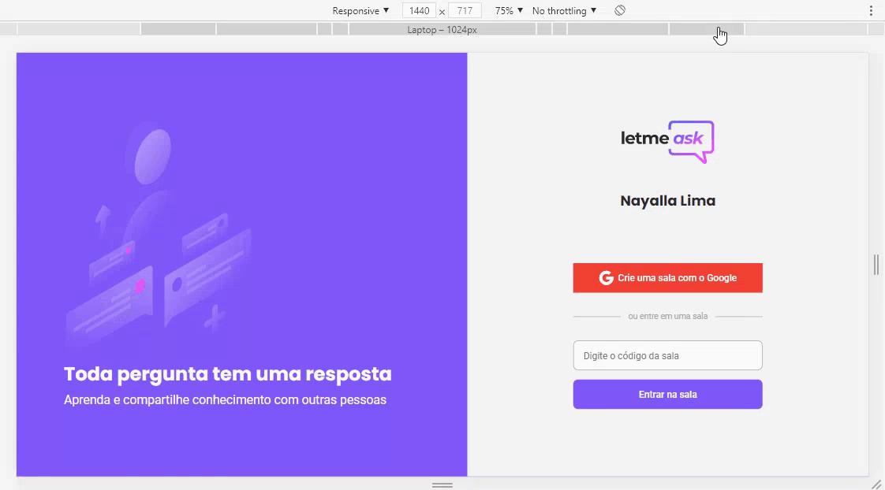

<h1 align="center">   </img> </h1>

  
  <a href="#-projeto">Projeto</a>&nbsp;&nbsp;&nbsp;|&nbsp;&nbsp;&nbsp;
  <a href="#-tecnologias-utilizadas">Tecnologias utilizadas</a>&nbsp;&nbsp;&nbsp;|&nbsp;&nbsp;&nbsp;
  <a href="#-layout">Layout</a>&nbsp;&nbsp;&nbsp;|&nbsp;&nbsp;&nbsp;
  <a href="#%EF%B8%8F-executando-a-aplicação">Executando a aplicação</a>&nbsp;&nbsp;&nbsp;|&nbsp;&nbsp;&nbsp;
  <a href="#%EF%B8%8F-contribuidores">Contribuidores</a>&nbsp;&nbsp;&nbsp;|&nbsp;&nbsp;&nbsp;
  <a href="#-licença">Licença</a>

## 💻 Projeto

Letmeask é perfeito para criadores de conteúdos poderem criar salas de Q&A com o seu público, de uma forma muito organizada e democrática. 

## ✅ Tecnologias utilizadas

- [Firebase](https://firebase.google.com/)
- [React](https://reactjs.org)
- [SASS](https://yarnpkg.com/package/node-sass)
- [TypeScript](https://www.typescriptlang.org/)

## 🎨 Layout

Você pode visualizar o layout do projeto através [desse link](https://www.figma.com/file/u0BQK8rCf2KgzcukdRRCWh/Letmeask/duplicate). É necessário ter conta no [Figma](http://figma.com/) para acessá-lo.

## ▶️ Executando a aplicação

- Clone o repositório para a sua máquina

  git clone https://github.com/nayallalima/LetMeAsk-NLW6.git

- Instale as dependências com `yarn install`

- Inicie o servidor com o comando `yarn start`
  
O app estará disponível no seu browser pelo endereço [`localhost:3000`](http://localhost:3000) do seu navegador.

Lembrando que será necessário criar uma conta no [Firebase](https://firebase.google.com/) e um projeto para disponibilizar um Realtime Database.

## ♥️ Contribuidores 

 Obrigada a todos que fazem parte da <a href="http://campinas.tech/campinas-tech-talents/">Rocketseat 🚀</a>, 

## 🔒 Licença

---

  Feito com 💜️ por <a href="https://github.com/nayallalima">Nayalla Lima </a>

